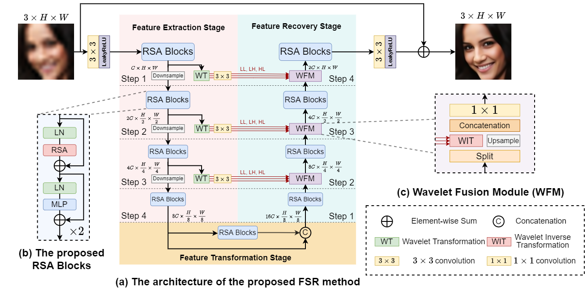

# Learning Attention from Attention: Efficient Self-Refinement Transformer for Face Super-Resolution (IJCAI 2023)



Code is coming soon.

## Citation
```
@InProceedings{LAATransformer,
    title = {Learning Attention from Attention: Efficient Self-Refinement Transformer for Face Super-Resolution},
    author = {Li, Guanxin and Shi, Jingang and Zong, Yuan and Wang, Fei and Wang, Tian and Gong, Yihong},
    Journal = {Proceedings of the Thirty-Second International Joint Conference on Artificial Intelligence (IJCAI)},
    year = {2023}
}
```